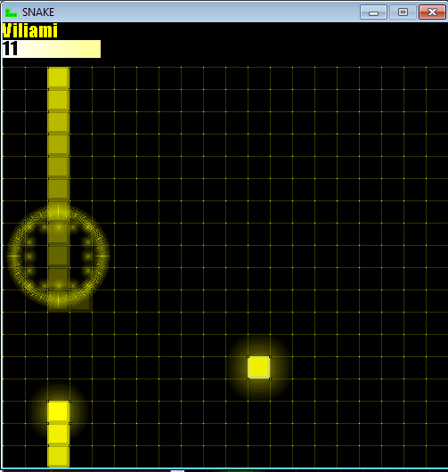

#Old Projects
Some old games that I programmed before I knew about coding practices.

###Snake
2D snake game made in Java. Has 2 player and 1 player mode. 2 player mode has 3 modes, AI, local and LAN (LAN is laggy). Also has a UI and leaderboard.

###Pacman
2D pacman game made in Java. 

